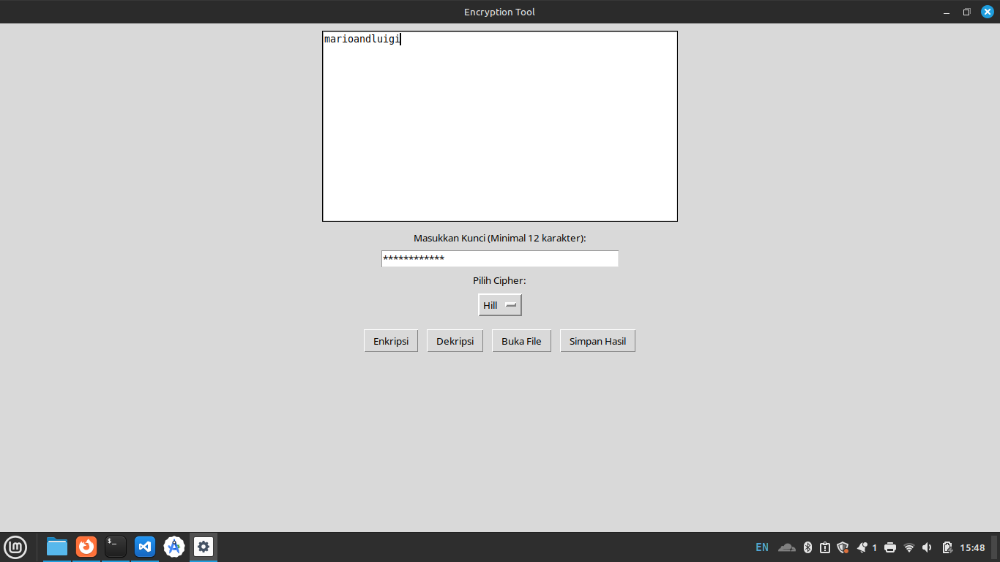

# Dokumentasi Tugas Kriptografi Ciphers

## How to use?

- Clone atau download repositori
- Install python di device yang digunakan
- Jalankan / Run file 'chipers-fixed.py'
- Input text yang dienkripsi atu didekripsi ke dalam kolom input
- Atau pilih input dari file txt dengan cara klik 'Buka File'
- Hasil enkripsi dan dekripsi dapat diunduh dengan cara klik 'Simpan Hasil'

## Sebelum enkripsi

## Setelah enkripsi

